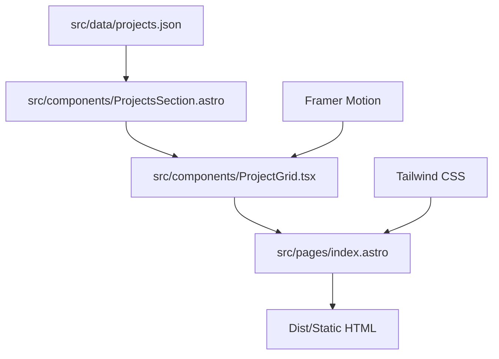

# Low-Level Design (LLD) - Galih Pratama Portfolio

## System Overview
The portfolio is a high-performance static site built with **Astro** and **Tailwind CSS**. It follows a component-driven architecture where content is externalized to data files to ensure maintainability and separation of concerns.

## Architecture Diagram

## Data Models

### Project Schema
Stored in `src/data/projects.json`.

| Field | Type | Description |
|-------|------|-------------|
| `id` | String | Unique slug (e.g., `akvo-rag`) |
| `name` | String | Display name of the project |
| `description` | String | Short pitch of the project |
| `longDescription` | String | Detailed case study explanation for modal dialog |
| `achievements` | Array[String]| Bullet highlights of key engineering achievements |
| `tags` | Array[String]| Technical stack or skills |
| `link` | String | External URL / Repository link |
| `featured` | Boolean | Whether to show in the featured section |
| `color` | String | UI accent color (red, blue, green, amber) |
| `category` | String | Project type (Enterprise, AI & RAG, Tools, Personal) |

### Experience Schema
Stored in `src/data/experience.json`.

| Field | Type | Description |
|-------|------|-------------|
| `company` | String | Organization name |
| `role` | String | Title / Position |
| `period` | String | Timeframe or category |
| `description` | String | Accomplishments summary |
| `skills` | Array[String]| Tech stack tags |

## Components Architecture
- **`Hero.astro`**: Main intro banner
- **`AboutSection.astro`**: Professional background
- **`ExperienceTimeline.astro`**: Career milestone timeline
- **`ProjectGrid.tsx`**: Interactive React island with real-time search, category filtering, and modal dialog case studies
- **`ContactSection.astro`**: Direct `mailto:` CTA & 1-click email address copy button
- **`Layout.astro`**: OpenGraph tags, JSON-LD `Person` schema, theme persistence

## Tech Stack (Aligned)
- **Framework**: Astro v5
- **UI**: React 19 + Tailwind CSS v4
- **Animations**: Framer Motion
- **Runtime**: Docker (via `./dc.sh` wrapper)

### ADR-001: JSON Content Externalization
- **Status**: Accepted
- **Context**: Project and experience data externalized to `src/data/projects.json` and `src/data/experience.json`.
- **Decision**: Externalize all project and timeline metadata for separation of concerns and maintainability.
- **Alternatives Considered**: Markdown (Astro Content Collections). Selected JSON for its simplicity and direct mapping to the existing project array structure.
- **Consequences**: Improved maintainability; content can be updated by non-developers or via automated scripts (like this agent).

## Security & Performance
- **Static Generation**: All content is pre-rendered at build time for maximum speed and security.
- **Image Optimization**: Astro's built-in image processing is used for any project assets.
